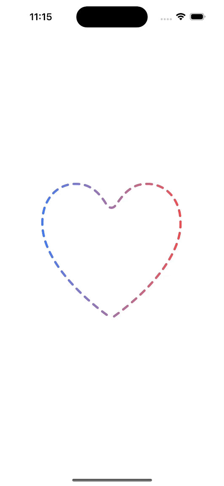
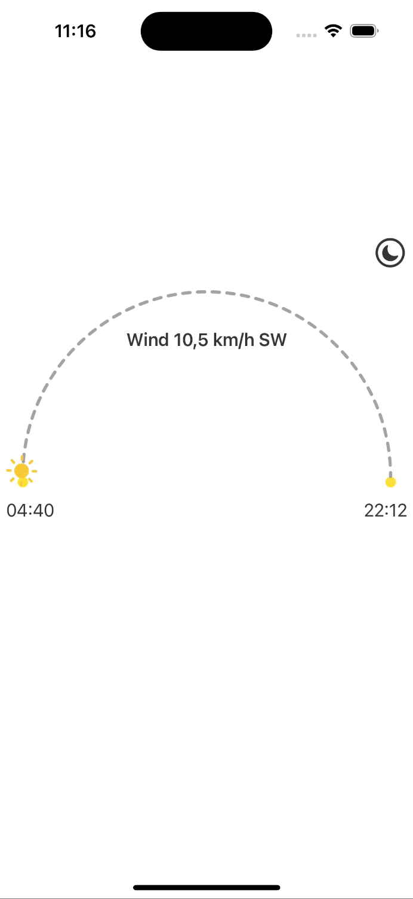
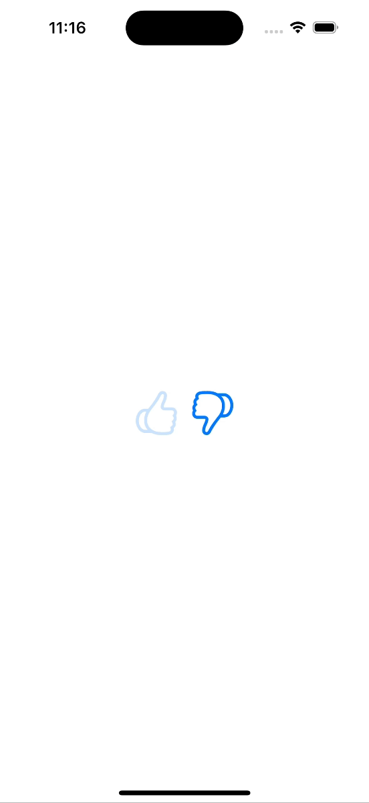
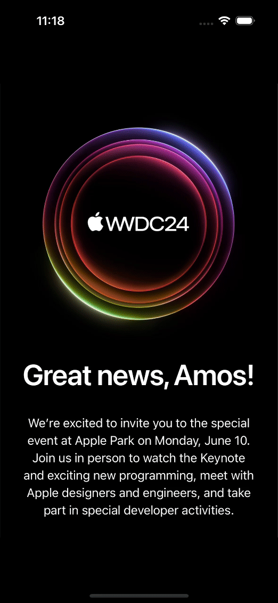
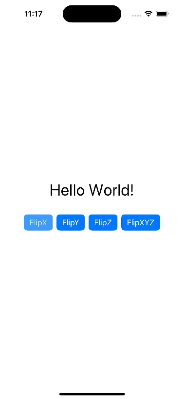
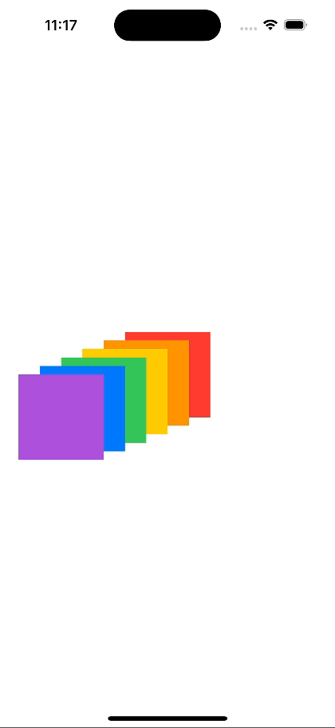
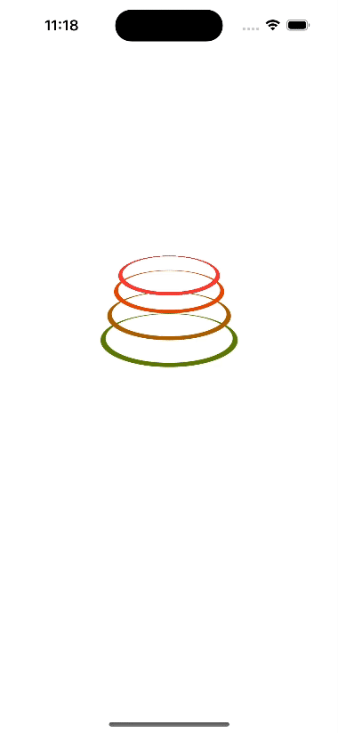
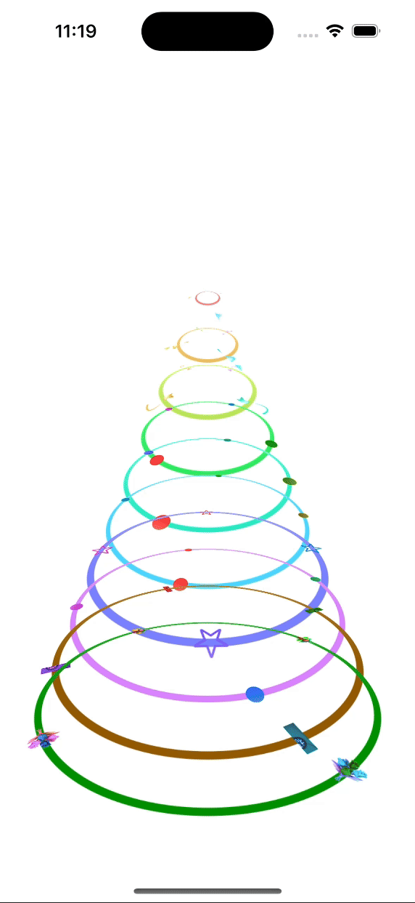

## Learning and Making SwiftUI Animations

### EaseIn

### EaseInOut

### Linear

### Linear2

### AnimationCompletion

### HueRotation

### FlipCharacters

### StackedRectangles

### Circles

### RotatingCircles

